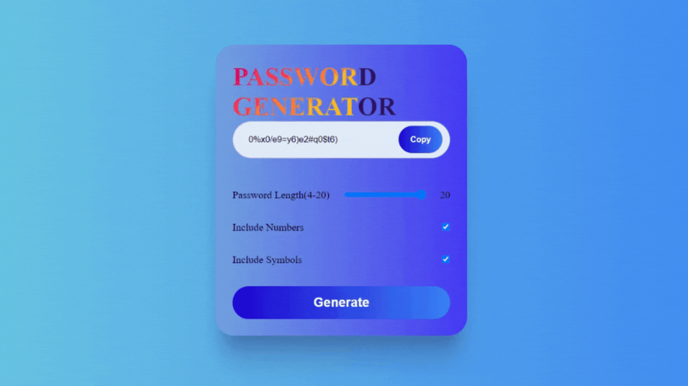

 

 
 

<h1>
  
  Password Generator Website
</h1>

This website is a password generator, with the options to choose if you want symbols or numbers in your password and also to choose its length.

 

<h2>

Usage
</h2>

To use and explore the website, simply open the HTML files in a web browser. You can access the website by clicking <a href="https://sarafreitas-dev.github.io/Password_Generator/src/">here</a>.

 

<h2>

Technologies Used</h2>
  
HTML

  
CSS

  
JavaScript

 
  
<h2>

Features
</h2>
  
Gradient effects

  
Text Animation

  
Random password generator with options

 

<h2>

License
</h2>

All rights reserved.

